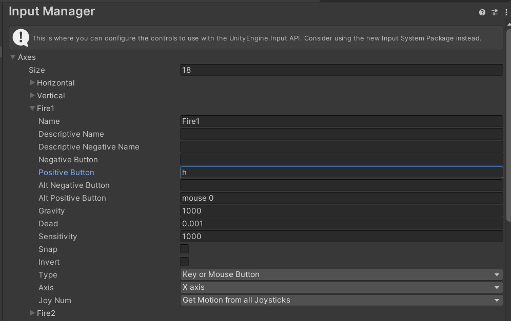

# Movimientos y física
* Esther M. Quintero
* alu0101434780@ull.edu.es

> [!WARNING]  
> Los gifs tardan un poco en cargar al abrirlo desde GitHub.

## Índice 

1. [Ejercicios de físicas 3d](#fisicas)
    * [Situación 1](#fisicas1)
    * [Situación 2](#fisicas2)
    * [Situación 3](#fisicas3)
    * [Situación 4](#fisicas4)
    * [Situación 5](#fisicas5)
    * [Situación 6](#fisicas6)
    * [Situación 7](#fisicas7)
    * [Situación 8](#fisicas8)
    * [Situación 9](#fisicas9)
2. [Ejercicios de la práctica 3](#practica)
    1. [Ejercicio 1](#uno)
    2. [Ejercicio 2](#dos)
    3. [Ejercicio 3](#tres)
    4. [Ejercicio 4](#cuatro)
    5. [Ejercicio 5](#cinco)
    6. [Ejercicio 6](#seis)
    7. [Ejercicio 7](#siete)
    8. [Ejercicio 8](#ocho)
    9. [Ejercicio 9](#nueve)
    10. [Ejercicio 10](#diez)
    11. [Ejercicio 11](#once)
    12. [Ejercicio 12](#doce)

## Tareas realizadas

### Ejercicios de físicas 3d 

#### Situación 1 

* El plano no es un objeto físico: tiene collider.
* La esfera no es un objeto físico: tiene collider.
* El cubo es un objeto físico: tiene rigidbody.

En este caso el cubo es el único que puede moverse por el motor de físicas (y chocar con el plano y la esfera).

    

#### Situación 2 

* El plano no es un objeto físico: tiene collider.
* La esfera es un objeto físico: tiene rigidbody.
* El cubo es un objeto físico: tiene rigidbody.

En este caso tanto el cubo como la esfera son movidos por el motor de físicas.

    

#### Situación 3 

* El plano no es un objeto físico: tiene collider.
* El cubo es un objeto físico: tiene rigidbody.
* La esfera es cinemática: isKinematic.

En este caso, la esfera a pesar de tener Rigidbody no puede ser movida por el motor de físicas.

   

#### Situación 4 

* El plano es un objeto físico: tiene rigidbody.
* La esfera es un objeto físico: tiene rigidbody.
* El cubo es un objeto físico: tiene rigidbody.

Al tener los tres comportamiento físico, se caen los tres.

    

#### Situación 5 

* El plano es un objeto físico: tiene rigidbody.
* La esfera es un objeto físico: tiene rigidbody.
* La esfera tiene 10 veces más masa que el cubo. 
* El cubo es un objeto físico: tiene rigidbody.

La esfera, a pesar de tener más masa no se mueve distinto, pues estamos en un entorno sin fricción (principio de equivalencia de Galileo, que establece que en ausencia de otras fuerzas, todos los cuerpos aceleran al mismo ritmo bajo la gravedad). Además, Unity ajusta automáticamente las velocidades usando el motor de física, por lo que aunque la masa afecta la inercia y la forma en que los objetos responden a las fuerzas, la velocidad final no depende de la masa en escenarios en los que las fuerzas aplicadas son uniformes y continuas. De hecho, si añadimos fricción podemos ver que la esfera "empuja" al cubo.

  

#### Situación 6 

* El plano es un objeto físico: tiene rigidbody.
* La esfera es un objeto físico: tiene rigidbody.
* La esfera tiene 100 veces más masa que el cubo. 
* El cubo es un objeto físico: tiene rigidbody.

Estamos ante el mismo caso que antes.

    

#### Situación 7 

* El plano es un objeto físico: tiene rigidbody.
* La esfera es un objeto físico: tiene rigidbody.
* La esfera es física con fricción.
* El cubo es un objeto físico: tiene rigidbody.

Al tener fricción la esfera, le cuesta más moverse.

   

#### Situación 8 

* El plano es un objeto físico: tiene rigidbody.
* La esfera no es un objeto físico: tiene collider.
* La esfera es trigger.
* El cubo es un objeto físico: tiene rigidbody.

En teoría, en esta configuración la esfera deja pasar objetos a través de ella. Sin embargo, por la situación actual no se da el caso. Es decir, la esfera está actuando esencialmente como un sensor (si algún objeto chocase con ella se podría detectar).

    

#### Situación 9 

* El plano es un objeto físico: tiene rigidbody.
* La esfera es un objeto físico: tiene rigidbody.
* La esfera es trigger.
* El cubo es un objeto físico: tiene rigidbody.

Aquí la situación parece exactamente igual a la de antes; sin embargo, la diferencia es que además de servir como trigger, la esfera se mueve. De hecho, en esta situación si el plano no fuera físico podemos ver que mueve el cubo y atraviesa el plano.

   

### Ejercicios de la práctica 

#### Ejercicio 1 

* Agrega un campo velocidad a un cubo y asígnale un valor que se pueda cambiar en el inspector de objetos. 
* Muestra la consola el resultado de multiplicar la velocidad por el valor del eje vertical y por el valor del eje horizontal cada vez que se pulsan las teclas flecha arriba-abajo ó flecha izquierda-derecha. 
* El mensaje debe comenzar por el nombre de la flecha pulsada. 

[Input]()

#### Ejercicio 2 

* Mapea la tecla H a la función disparo. 

[Input Manager]()

#### Ejercicio 3 

* Crea un script asociado al cubo que en cada iteración traslade al cubo una cantidad proporcional un vector que indica la dirección del movimiento: moveDirection que debe poder modificarse en el inspector.  
* La velocidad a la que se produce el movimiento también se especifica en el inspector, con la propiedad speed. 
* Inicialmente la velocidad debe ser mayor que 1 y el cubo estar en una posición y=0. 
* En el informe de la práctica comenta los resultados que obtienes en cada una de las siguientes situaciones:
    * duplicas las coordenadas de la dirección del movimiento.
    * duplicas la velocidad manteniendo la dirección del movimiento.
    * la velocidad que usas es menor que 1
    * la posición del cubo tiene y>0
    * intercambiar movimiento relativo al sistema de referencia local y el mundial.

[Vector3]()
[Translate]()

#### Ejercicio 4 

* Mueve el cubo con las teclas de flecha arriba-abajo, izquierda-derecha a la velocidad speed. 
* Cada uno de estos ejes implican desplazamientos en el eje vertical y horizontal respectivamente. 
* Mueve la esfera con las teclas w-s (movimiento vertical) a-d (movimiento horizontal).

#### Ejercicio 5 

* Adapta el movimiento en el ejercicio 4 para que sea proporcional al tiempo transcurrido durante la generación del frame.

[Time.DeltaTime]()

#### Ejercicio 6 

* Adapta el movimiento en el ejercicio 5 para que el cubo se mueva hacia la posición de la esfera. 
* Debes considerar, que el avance no debe estar influenciado por cuánto de lejos o cerca estén los dos objetos.

#### Ejercicio 7 

* Adapta el movimiento en el ejercicio 6 de forma que el cubo gire hacia la esfera. 
* Realiza pruebas cambiando la posición de la esfera mediante las teclas awsd

[Método LookAt]()

#### Ejercicio 8 

* Utilizar el eje “Horizontal” para girar el objetivo y que avance siempre en la dirección hacia adelante.

[Método fordward]()
[Debug.DrawRay]()

#### Ejercicio 9 

* Configura el cilindro como un objeto físico, cuando el cubo o la esfera colisionen con él se debe mostrar un mensaje en consola con la etiqueta del objeto que haya colisionado.

#### Ejercicio 10 

* Configura el cubo como un objeto cinemático y la esfera como un objeto físico. 
* Adapta los scripts del ejercicio 9 para obtener el mismo comportamiento.

[OnCollision]()
[OnTrigger]()

#### Ejercicio 11 

* Configura el cilindro como un objeto de tipo Trigger. 
* Adapta los scripts de los ejercicios anteriores para obtener el mismo comportamiento.

#### Ejercicio 12 

* Agrega un cilindro de un color diferente al que ya hay en la escena y configúralo como un objeto físico. 
* Selecciona un conjunto de teclas que te permitan controlar su movimiento por la escena y prográmale un movimiento que permita dirigirlo hacia la esfera. 
* Prueba diferentes configuraciones de la esfera física con masa 10 veces mayor que el cilindro, física con masa 10 veces menor que el cilindro, cinemática y trigger. 
* También prueba la configuración del cilindro de forma que su fricción se duplique o no. 
* Explica en el informe todos los resultados posibles. 

[Motor de físicas]()
