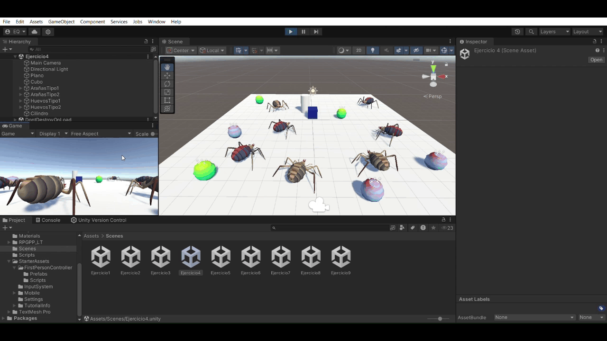

# Delegados y eventos
* Esther M. Quintero
* alu0101434780@ull.edu.es

> [!WARNING]  
> Los gifs tardan un poco en cargar al abrirlo desde GitHub.

## Índice 

1. [Ejercicios de la práctica 3](#practica)
    1. [Ejercicio 1](#uno)
    2. [Ejercicio 2](#dos)
    3. [Ejercicio 3](#tres)
    4. [Ejercicio 4](#cuatro)
    5. [Ejercicio 5](#cinco)
    6. [Ejercicio 6](#seis)
    7. [Ejercicio 7](#siete)
    8. [Ejercicio 8](#ocho)
    9. [Ejercicio 9](#nueve)

## Tareas realizadas

### Ejercicios de la práctica 

#### Ejercicio 1 

* Escena: 
  * Un plano
  * Un cilindro (Con el que se puede colisionar)
  * Un cubo (Que tiene movilidad)
  * Esferas de dos tipo (tipo 1 y tipo 2)
* Funcionamiento:
  * Cuando el cubo colisiona con el cilindro:
    * Las esferas de tipo 1 se dirigen hacia una esfera de tipo 2
    * Las esferas de tipo 2 se desplazan hacia el cilindro

[Collider](https://docs.unity3d.com/ScriptReference/Collider.html)    
[OnTrigger events](https://docs.unity3d.com/Manual/collider-interactions-ontrigger.html)

   

#### Ejercicio 2 

* Sustituir las esferas por arañas
* Sustituir el cilindro por un huevo

 

[Asset de las arañas](https://assetstore.unity.com/packages/3d/characters/creatures/fuga-spiders-with-destructible-eggs-and-mummy-151921)

#### Ejercicio 3 

* Ahora hay arañas de tipo 1 y arañas de tipo 2.
* También hay huevos de tipo 1 y huevos de tipo 2.
* Cuando el cubo colisione con una araña del tipo 2:
  * Las del tipo 1 se acercarán a un objeto.
* Cuando el cubo colisiones con una araña del tipo 1:
  * Las arañas del tipo 1 van hacia huevos del tipo 2.
  * Si tocan uno, deben cambiar de color.

   

#### Ejercicio 4 

* Cuando el cubo colisione con el cilindro:
  * Las arañas del grupo 1 se teletransportan a un huevo fijado.
  * Las arañas del grupo 2 se orientan hacia un objeto fijado.

   

#### Ejercicio 5 

* Implementación de la mecánica de recolectar huevo.
* Añadir una puntuación para el jugador:
  * Las arañas de tipo 1 suman 5 puntos.
  * Las arañas de tipo 2 suman 10 puntos.
  * Mostrar la puntuación por consola.

   

#### Ejercicio 6 

* Interfaz que muestre la puntuación.

[Canvas](https://docs.unity3d.com/ScriptReference/Canvas.html)

   

#### Ejercicio 7 

* Añadir que cada 100 puntos el jugador tiene una recompensa.
* Mostrar esa recompensa en la UI.

   

#### Ejercicio 8 

* Generar una escena que tenga elementos que se ajusten a la escena del prototipo y alguna de esa mecánicas.

   

#### Ejercicio 9 

* Implementar el ejercicio 3 siendo el cubo un objeto físico.

   

