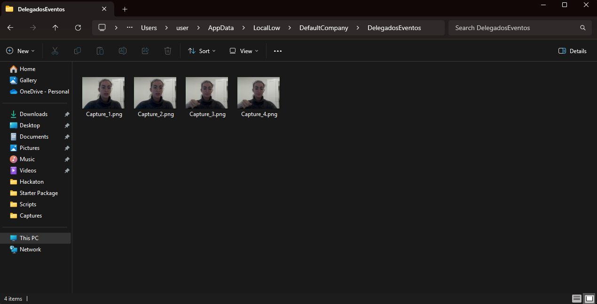

# Cámara y micrófono
* Esther M. Quintero
* alu0101434780@ull.edu.es

> [!WARNING]  
> Los gifs tardan un poco en cargar al abrirlo desde GitHub.

## Índice

1. [Micrófono](#microfono)
  1. [Reproducir un sonido al chocar](#chocar)
  1. [Grabar y reproducir](#grabar)
1. [Cámara](#camara)

### Micrófono <div id='microfono'/>

#### Sonido al chocar <div id='chocar'/>

1. Utilizar la escena de las arañas y activa la reproducción de alguno de los sonidos incluidos en la carpeta adjunta cuando la araña alcanza algún objetivo.

``` csharp
using System.Collections;
using System.Collections.Generic;
using UnityEngine;

public class Sound: MonoBehaviour {
    public AudioClip collisionSound; // El sonido que se reproducirá al chocar
    private AudioSource audioSource; // Fuente de audio para reproducir el sonido

    // Start se llama antes del primer frame de actualización
    void Start() {
        // Inicializa el componente AudioSource
        audioSource = gameObject.AddComponent<AudioSource>();
        audioSource.playOnAwake = false;
    }

    // Método que se llama cuando este objeto colisiona con otro
    void OnTriggerEnter(Collider other) {
        if (other.tag != "Plano") {
            Debug.Log("Repoduciendo sonido de colisión");
            audioSource.PlayOneShot(collisionSound);
        }
    }
}

```

<video controls src="./Multimedia/SonidoChoque.mp4" title="SonidoChoque"></video>

#### Grabar y reproducir <div id='grabar'/>

2. Reproducir el AudioClip que genera el micrófono.

``` csharp
using System.Collections;
using System.Collections.Generic;
using UnityEngine;

public class Grabadora: MonoBehaviour {
    private AudioSource audioSource; // Componente de audio para grabar y reproducir
    private string micName; // Nombre del micrófono
    private bool isRecording = false; // Para controlar el estado de grabación

    // Start se llama antes del primer frame de actualización
    void Start() {
        // Recuperar el componente AudioSource
        audioSource = gameObject.AddComponent<AudioSource>();
        audioSource.loop = false; // Configuramos el audio para que no sea en bucle

        // Comprobar si hay micrófonos disponibles
        if (Microphone.devices.Length > 0) {
            micName = Microphone.devices[0]; // Usar el primer micrófono disponible
            Debug.Log($"Micrófono encontrado: {micName}");
        } else {
            Debug.LogError("No se detectaron micrófonos en este dispositivo.");
        }
    }

    // Update se llama una vez por frame
    void Update() {
        // Iniciar la grabación al mantener presionada la tecla 'R'
        if (Input.GetKeyDown(KeyCode.R)) {
            if (!isRecording && !audioSource.isPlaying) {
                Debug.Log("Iniciando grabación...");
                audioSource.clip = Microphone.Start(micName, false, 10, 44100); // Grabar por 10 segundos como máximo
                isRecording = true;
            }
        }

        // Detener la grabación y reproducir el audio al soltar la tecla 'R'
        if (Input.GetKeyUp(KeyCode.R)) {
            if (isRecording) {
                Microphone.End(micName);
                Debug.Log("Grabación detenida. Reproduciendo audio...");
                audioSource.Play(); // Reproducir el clip grabado
                isRecording = false;
            }
        }
    }
}
```

<video controls src="./Multimedia/Grabacion.mp4" title="Grabacion"></video>

### Cámara <div id='camara'/>

1. Grabar con la cámara y mostrarlo en un objeto
2. Mostrar el nombre de la cámara

``` csharp

using System.Collections;
using System.Collections.Generic;
using UnityEngine;

public class Camara: MonoBehaviour {
    /// Declaración de variables: Material, WebCamTexture y String para almacenar el path del directorio donde almacenar las imágenes
    private Material tvMaterial; // Material del objeto donde se muestra la cámara
    private WebCamTexture webcamTexture; // Textura de la cámara
    private string savePath; // Ruta donde guardar imágenes
    int captureCounter = 1; // Contador para el nombre de las capturas

    // Start se llama antes del primer frame de actualización
    void Start() {
        // Inicializar el material al que posteriormente se asignará cada imagen-frame de la cámara
        GameObject plane = GameObject.FindWithTag("Plano"); // Buscar el objeto con el tag "Plano"
        if (plane != null) {
            Renderer renderer = plane.GetComponent<Renderer>();
            tvMaterial = renderer.material;
            Debug.Log("Material del plano asignado correctamente.");
        } else {
            Debug.LogError("No se encontró un objeto con el tag 'Plano'.");
        }

        // Usar el constructor de WebCamTexture para inicializar una variable de ese tipo
        if (WebCamTexture.devices.Length > 0) {
            string selectedCamera = WebCamTexture.devices[2].name;
            webcamTexture = new WebCamTexture(selectedCamera);
            Debug.Log($"Cámara seleccionada: {selectedCamera}");
        } else {
            Debug.LogError("No se detectaron cámaras en este dispositivo.");
        }

        foreach (var device in WebCamTexture.devices) {
            Debug.Log($"Cámara encontrada: {device.name}");
        }

        // Inicializar la ruta para guardar capturas
        savePath = Application.persistentDataPath;
        Debug.Log($"Ruta de almacenamiento de imágenes: {savePath}");
    }

    // Update se llama una vez por frame
    void Update() {
        if (Input.GetKey("s")) {
            if (webcamTexture != null && !webcamTexture.isPlaying) {
                // Asignar a la mainTexture del material lo que capta la cámara
                tvMaterial.mainTexture = webcamTexture;
                webcamTexture.Play(); // La captura se inicia
                Debug.Log("Captura de video iniciada.");
            }
        }

        if (Input.GetKey("p")) {
            if (webcamTexture != null && webcamTexture.isPlaying) {
                // Parar la captura de video
                webcamTexture.Stop();
                Debug.Log("Captura de video detenida.");
            }
        }
    }
}

```

<video controls src="./Multimedia/CamaraNombre.mp4" title="CamaraNombre"></video>

3. Guardar fotogramas


``` csharp
if (Input.GetKey("x")) {
    if (webcamTexture != null && webcamTexture.isPlaying) {
        // Capturar la imagen actual de la cámara
        Texture2D capture = new Texture2D(webcamTexture.width, webcamTexture.height);
        capture.SetPixels(webcamTexture.GetPixels());
        capture.Apply();

        // Guardar la imagen en la ruta definida
        byte[] bytes = capture.EncodeToPNG();
        string fileName = $"{savePath}/Capture_{captureCounter}.png";
        System.IO.File.WriteAllBytes(fileName, bytes);
        captureCounter++;
        Debug.Log($"Imagen capturada y guardada en: {fileName}");
    } else {
        Debug.LogWarning("No se está capturando video. No se puede guardar la imagen.");
    }
}
```

