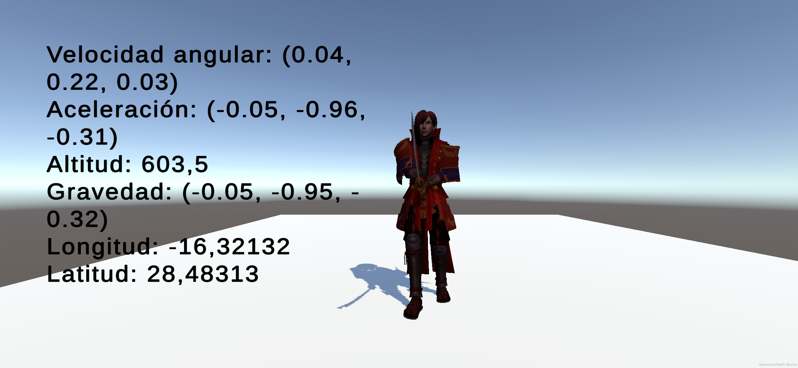
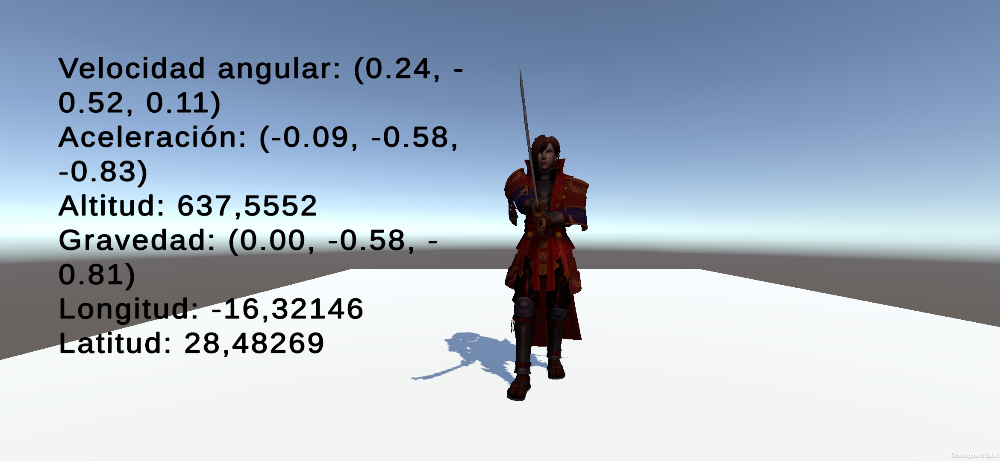

# Sensores
* Esther M. Quintero
* alu0101434780@ull.edu.es

> [!WARNING]  
> Los gifs tardan un poco en cargar al abrirlo desde GitHub.

1. [Componentes del móvil](#componentes)
1. [Mover samurai](#samurai)

## Componentes <div id='componentes'/>

     
    

``` csharp
using UnityEngine;
using TMPro;

public class DeviceUIManager: MonoBehaviour {
    public TextMeshProUGUI compassText;
    public TextMeshProUGUI accelerationText;
    public TextMeshProUGUI gpsText;

    private bool gpsEnabled = false;

    void Start() {
        // Activar brújula y GPS
        Input.compass.enabled = true;
        Input.location.Start(10f, 10f);

        // Verificar si el GPS está funcionando
        if (Input.location.status == LocationServiceStatus.Running) {
            gpsEnabled = true;
        } else {
            Debug.LogError("GPS no está disponible");
        }
    }

    void Update() {
        // Mostrar datos de la brújula
        float heading = Input.compass.trueHeading;
        compassText.text = $"Brújula: {heading:F2}°";

        // Mostrar datos del acelerómetro
        Vector3 acceleration = Input.acceleration;
        accelerationText.text = $"Aceleración: X={acceleration.x:F2}, Y={acceleration.y:F2}, Z={acceleration.z:F2}";

        // Mostrar datos del GPS si está habilitado
        if (gpsEnabled) {
            gpsText.text = $"GPS: Lat={Input.location.lastData.latitude:F6}, Lon={Input.location.lastData.longitude:F6}, Alt={Input.location.lastData.altitude:F2}";
        }
    }

    void OnDestroy() {
        // Detener servicios de GPS al finalizar
        Input.location.Stop();
    }
}
```

## Mover samurai <div id='samurai'/>

``` csharp
using UnityEngine;

public class SamuraiController: MonoBehaviour {
    public Transform samuraiTransform; // Transform del samurái
    public float smoothing = 0.1f;     // Suavizado de la rotación

    void Start() {
        // Cogemos el Transform del objeto
        samuraiTransform = GetComponent<Transform>();
    }

    void Update() {
        // Obtener datos de la brújula y rotar el samurái hacia el norte
        float heading = Input.compass.trueHeading;
        RotateSamuraiToNorth(heading);

        // Obtener datos del acelerómetro y mover el samurái
        Vector3 acceleration = Input.acceleration;
        MoveSamurai(acceleration);
    }

    void RotateSamuraiToNorth(float heading) {
        Quaternion targetRotation = Quaternion.Euler(0f, heading, 0f);
        samuraiTransform.rotation = Quaternion.Slerp(samuraiTransform.rotation, targetRotation, smoothing);
    }

    void MoveSamurai(Vector3 acceleration) {
        Vector3 movement = new Vector3(0, 0, -acceleration.z); // Invertir Z para orientación
        movement = samuraiTransform.TransformDirection(movement); // Aplicar orientación del objeto
        samuraiTransform.position += movement * Time.deltaTime;
    }
}

```


